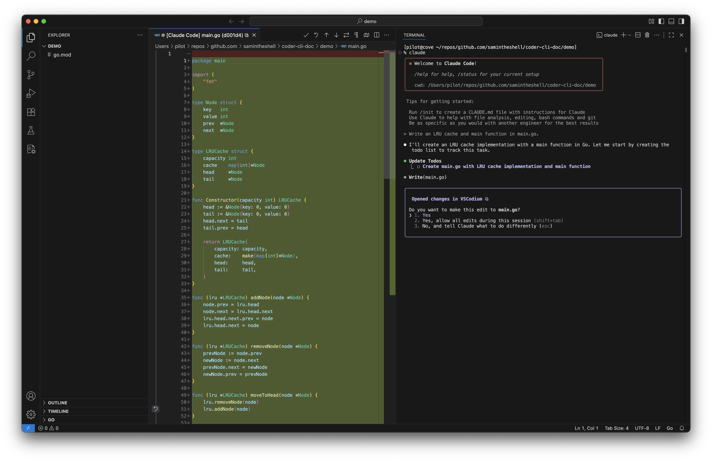

# Coder CLI Doc
These Coder CLIs are extremely flexible.
You can use them with IDE integrations, in the terminal, or in task automation.

Some thoughts on code assist security are included in [SECURITY.md](SECURITY.md).

## Installing the IDE Extensions
Using [VS Codium](https://vscodium.com/) is recommended.
If you use VS Code, just replace `codium` with `code`.
```bash
codium --install-extension anthropic.claude-code
codium --install-extension google.gemini-cli-vscode-ide-companion
codium --install-extension qwenlm.qwen-code-vscode-ide-companion
```

## Terminal
Open a terminal and run the the command `claude`, `gemini`, or `qwen`.

As a recommendation, you can drag the terminal tab in the panel out to the right hand panel.

## Qwen Code
Using `qwen` opens up the ability to use `gpt-oss:20b` and `qwen3:4b` for coding tasks.
These models aren't anywhere near as good as `claude-sonnet-4` or `gemini-2.5-pro`, but they can do some work if your hardware can run them effectively.

For `qwen` to use the [Ollama](https://ollama.com) API, the following setup will need to be done in your terminal profile (eg. `~/.bash_profile` or `~/.bashrc` or `~/.zshrc`).
```shell
export OPENAI_BASE_URL=http://localhost:11434/v1
export OPENAI_API_KEY=ollama
export OPENAI_MODEL=gpt-oss:20b
```

When wanting to run a different model one time, you can run this in your Codium terminal.
```shell
OPENAI_MODEL=qwen3:4b qwen
```

Running `qwen` from source can be done as well (this works for `gemini` too).
This is necessary with local models because the default templated prompt the CLI makes can cause smaller models to waste time doing needless tasking that they aren't even suitable for.

Setting this alias in your terminal profile will run `qwen` from source.
```shell
alias qwen="npx ${HOME}/repos/github.com/samintheshell/qwen-code"
```

## Screenshots
### Claude

### Gemini

### Qwen


